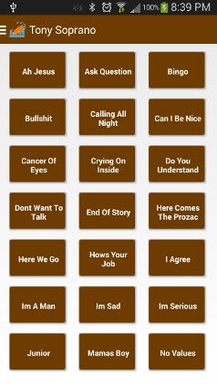
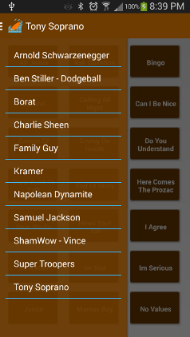

soundboarder-android
====================

Sound Boarder Android App

I created this app because I was tired with existing soundboard apps that have ads.

Thanks to @terrellb87 for the logo and sounds.

The sounds are left out of this repo, but you can add your own sounds in the assets folder. 
Sound files should be named CamelCase and be in the .ogg format. Update SoundboardFragment::createSounds and boards_array in strings.xml with your soundboard folders.
